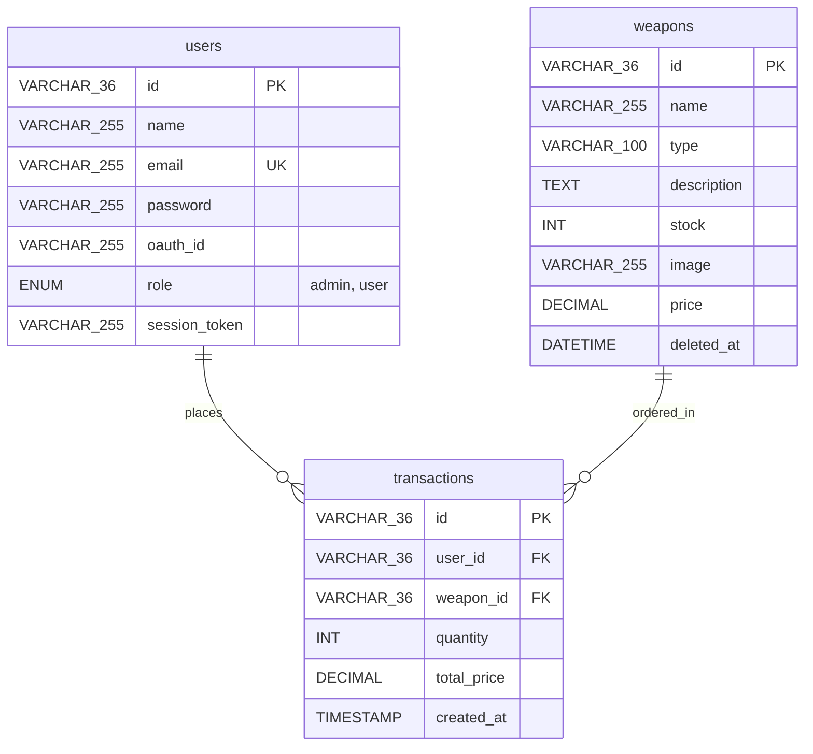

# Genshin Import REST API — Backend Documentation

Welcome to the backend REST API documentation for **Genshin Import (Mobile Hybrid Solution)**. This backend serves as the core coordinator for managing the weapons catalog, validating and logging user transactions atomically, and verifying authorization levels.

---

## 1. Architectural Design Overview

This project is built using a **layered service-repository pattern** in **Node.js Express** connecting to a **MySQL database**. It separates concerns to ensure maintainability, testing isolation, and clear security boundaries.

### Core Technology Stack:
* **Runtime:** Node.js (v24.11.0, utilizing ES Modules)
* **Framework:** Express.js
* **Database Driver:** `mysql2/promise` (connection pooling and async query support)
* **Encryption:** `bcryptjs` (password hashing)
* **Tokenizer:** Random 20-character alphanumeric generator (native `crypto`)

### Directory Structure:
```
backend/
  ├── package.json          # Dependency registrations and scripts
  ├── .env                  # Environmental configuration variables
  ├── database/
  │     ├── schema.sql      # Database structure and seeded accounts
  │     └── init_db.js      # Automatic database installer
  ├── tests/
  │     ├── api.http        # REST Client test suite
  │     └── integration.js  # Automated integration test runner
  └── src/
        ├── app.js          # App entrypoint, CORS configuration & health checks
        ├── config/
        │     └── db.js     # MySQL promise connection pool setup
        ├── middleware/
        │     ├── authMiddleware.js   # Bearer token parsing, session checks & RBAC
        │     └── errorMiddleware.js  # Centralized JSON error format handler
        ├── repositories/   # SQL Query Isolation Layer (no business logic)
        │     ├── userRepository.js
        │     ├── weaponRepository.js
        │     └── transactionRepository.js
        ├── services/       # Domain Rules Layer (validations, transactions, tokens)
        │     ├── authService.js
        │     ├── weaponService.js
        │     └── transactionService.js
        ├── controllers/    # Request parsers and HTTP response formatters
        │     ├── authController.js
        │     ├── weaponController.js
        │     └── transactionController.js
        └── routes/         # Endpoint route mappings
              ├── authRoutes.js
              ├── weaponRoutes.js
              └── transactionRoutes.js
```

---

## 2. Getting Started & Installation

### Prerequisite: MySQL Running via XAMPP
Open your **XAMPP Control Panel** and ensure that the **MySQL** module is started. By default, it runs on port `3306`.

### Step 1: Install Dependencies
From the `backend` directory, run:
```bash
npm install
```

### Step 2: Configure Environment Variables
Verify your connection parameters in `.env` (it will auto-create if missing, pointing to default XAMPP settings):
```ini
PORT=3000
DB_HOST=localhost
DB_PORT=3306
DB_USER=root
DB_PASSWORD=
DB_NAME=genshin_import
```

### Step 3: Initialize Database schemas
Run the automated schema script to create the database, establish table structures, and inject initial seed data:
```bash
npm run db:init
```

### Step 4: Run the Server
* **Development Mode (watch mode):**
  ```bash
  npm run dev
  ```
* **Production Mode:**
  ```bash
  npm start
  ```

---

## 3. Database Schema

The database uses **UUID v4 (36-character VARCHAR)** as the primary key format across all tables to guarantee security and scalability.



### Tables details:
1. **`users`:** Holds user profiles and credentials. The `session_token` column stores the active random 20-character login tokens.
2. **`weapons`:** Product database. It uses a `deleted_at` datetime flag for **Soft Deletes**. When a weapon is deleted, it is hidden from the active catalog retrieval query, but all historical records in `transactions` pointing to it remain database-integral.
3. **`transactions`:** Purchase ledger containing reference keys (`user_id`, `weapon_id`), quantity, total cost, and a timestamp.

---

## 4. Authentication & Security Architecture

This backend implements a custom authentication design adhering to regulatory requirements that forbid external JWT token libraries:

### Alphanumeric Session Token Mechanism
1. Upon successful verification of credentials (email/password or oauth verification), `authService.js` creates a **20-character random alphanumeric string** using:
   ```javascript
   crypto.randomBytes(10).toString('hex');
   ```
2. The session token is saved in the database under the user's `session_token` column.
3. Subsequent requests to protected endpoints must pass this token in the header:
   ```http
   Authorization: Bearer <20_character_token>
   ```

### Middleware Authentication & RBAC Flow
* **`authMiddleware.js`:**
  * Extracts the token from the `Authorization: Bearer <token>` header.
  * Queries the database for a user matching the token. If not found, returns a `401 Unauthorized` status.
  * Attaches the authenticated user object (`id`, `name`, `email`, `role`) to `req.user`.
* **`roleMiddleware.js`:**
  * Checks if the `req.user.role` matches the permitted values (e.g. `roleMiddleware(['admin'])`). If unauthorized, it terminates the request with a `403 Forbidden` status.

---

## 5. REST API Specifications

All endpoints return uniform JSON objects. Success responses include standard messages and HTTP codes.

### 5.1 Authentication Endpoints (`/api/auth`)

| Method | Endpoint | Access | Description |
| :--- | :--- | :--- | :--- |
| `POST` | `/api/auth/register` | Public | Register local user account. Password hashed with Bcrypt (10 rounds). |
| `POST` | `/api/auth/login` | Public | Manual credential verification. Returns user data and the 20-character custom Bearer Token. |
| `POST` | `/api/auth/oauth` | Public | Processes Google/Facebook OAuth callbacks. Synchronizes credentials. |
| `POST` | `/api/auth/logout` | User/Admin | Invalidates the token in the DB by setting `session_token` to `NULL`. |

#### Response Format (Successful Login):
```json
{
  "message": "Login berhasil!",
  "token": "87ffc25c01d3f5ed2a4a",
  "user": {
    "id": "b287955d-16ef-46e3-82bd-dfcdcf209b5a",
    "name": "Tabibito User",
    "email": "user@gachamerch.com",
    "role": "user"
  }
}
```

---

### 5.2 Weapons & Catalog Endpoints (`/api/weapons`)

| Method | Endpoint | Access | Description |
| :--- | :--- | :--- | :--- |
| `GET` | `/api/weapons` | Public | Lists active weapons (`WHERE deleted_at IS NULL`). |
| `GET` | `/api/weapons/:id` | User/Admin | Fetches detailed parameters of a weapon. |
| `POST` | `/api/weapons` | Admin Only | Adds a new weapon or artifact. Price/stock must be $>0$ (VAL-02). |
| `PUT` | `/api/weapons/:id` | Admin Only | Updates weapon information or increases stock. |
| `DELETE` | `/api/weapons/:id` | Admin Only | Performs a soft delete by setting `deleted_at = NOW()`. |

---

### 5.3 Transactions Endpoints (`/api/transactions`)

All transaction routes require a valid Bearer token.

| Method | Endpoint | Access | Description |
| :--- | :--- | :--- | :--- |
| `POST` | `/api/transactions` | User/Admin | Processes an item purchase. Stock is checked and decremented atomically. |
| `GET` | `/api/transactions/history` | User/Admin | Returns the transaction history of the authenticated user. |

#### Request Payload:
```json
{
  "weapon_id": "w1000001-eb23-49ec-8cb3-7a9192461421",
  "quantity": 2
}
```

---

## 6. Business Validation & Atomicity Rules

### Database ACID Transactions
Purchases require strict atomic synchronization between stock level verification, product decrement, and transaction logs. This is accomplished using database transactions:
1. Express checks out a dedicated MySQL connection from the pool.
2. Runs `START TRANSACTION` followed by:
   ```sql
   SELECT id, name, stock, price, deleted_at FROM weapons WHERE id = ? FOR UPDATE;
   ```
   The `FOR UPDATE` modifier **locks the row** for this transaction, ensuring no parallel purchase requests read stale stock volumes.
3. Checks VAL-03 stock threshold. If quantity requested exceeds stock capacity, it issues `ROLLBACK` and responds with `422`.
4. Decrements stock in the database:
   ```sql
   UPDATE weapons SET stock = stock - ? WHERE id = ?;
   ```
5. Inserts transaction log details.
6. Executes `COMMIT` and releases the connection back to the pool.

### Validation Codes (FE & BE Sync)

* **`VAL-01` (Login validation):**
  * Email must contain `@` and cannot be empty. Password must be $\ge$ 6 characters.
  * *Response on failure (422):* `{"message": "Format email tidak valid atau password terlalu pendek!"}`
* **`VAL-02` (Product CRUD validation):**
  * Name, price, and stock cannot be empty. Price and stock must be numbers $> 0$.
  * *Response on failure (422):* `{"message": "Data produk tidak valid! Pastikan harga dan stok berupa angka positif."}`
* **`VAL-03` (Purchase limit validation):**
  * Order quantity must not exceed available stock in locked row state.
  * *Response on failure (422):* `{"message": "Transaksi Gagal: Jumlah pembelian melebihi sisa stok yang tersedia!"}`

---

## 7. Automated Testing Suite

The project includes a built-in automated integration test runner. The test script dynamically boots the Express API, issues asynchronous HTTP requests via global fetch matching the test scenarios, asserts status outputs, verifies the MySQL database row values post-transaction, and cleanly shuts down the server.

### Execute the Tests:
Run the command below from the `backend` folder:
```bash
npm run test
```
All integration scenarios (health check, admin CRUD, purchase stock deductions, soft delete verification) will evaluate and log success status codes on completion.
